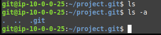

# Setup
Step 1. Create a user named git on your AWS Ubuntu instance. 
Step 2. Sign in as git, create a directory called ".ssh/" and a file called "authorized_keys" in ".ssh/". 
Step 3. Run "chmod 700 .ssh && chmod 600 .ssh/authorized_keys" to set the permissions. 
Step 4. Add your github public key to the "authorized_keys" file. Reference https://docs.github.com/en/github/authenticating-to-github/connecting-to-github-with-ssh/generating-a-new-ssh-key-and-adding-it-to-the-ssh-agent#generating-a-new-ssh-key  
Step 5. Run git init. 
Step 6. Add the private key created on the AWS instance to your ssh-agent on the host machine. https://docs.github.com/en/github/authenticating-to-github/connecting-to-github-with-ssh/generating-a-new-ssh-key-and-adding-it-to-the-ssh-agent#adding-your-ssh-key-to-the-ssh-agent
  Note: Make sure you add the public SSH key to your github account. 

# Usage
How to clone, add, commit, and push from a given system to a repo hosted on the AWS Ubuntu Instance.

Cloning: To clone to your machine, use the command "git clone git@AWS_IP:/awsfullpath/to/git/PROJECTNAME.git". You must have the private key generated on the AWS instance added to the ssh agent on your local machine. 
Adding: To add to the repo, navigate to the project folder on the local machine. Run "git init", then run "git add ." which will add all the files in the project folder to the staging area to be committed. <bv>
Commit: To track and submit changes that you've made to your files and save them to the local machine version of git, you need to commit them. Run "git commit -m 'comment about what you're committing'". To "see" the remote repo, add it with "git remote add origin git@AWS_IP:/awsfullpath/to/git/PROJECTNAME.git" 
Push: Pushing will push the changes made on a local/given machine to the remote repo. Use "git push origin master", provided you have added or cloned the repo as described previously.

# Proof

