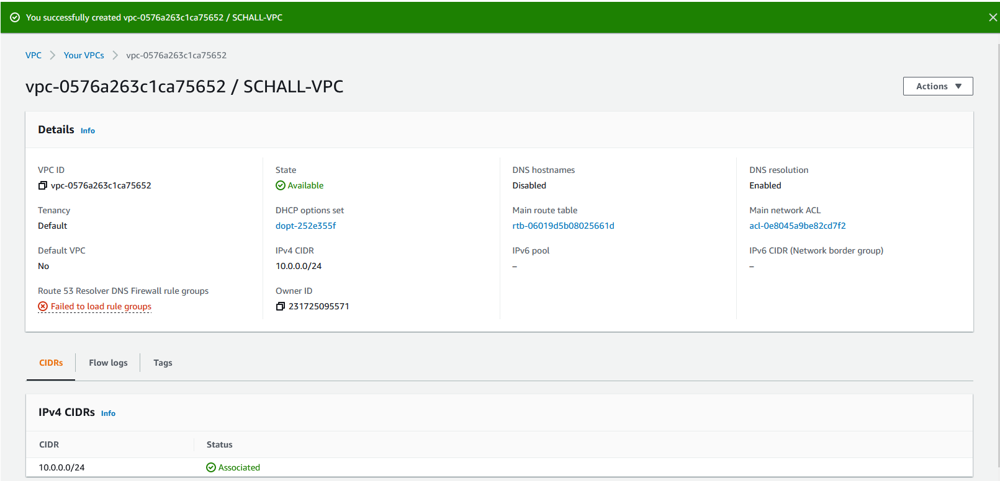

# Project 3
## Part 1: Building a VPC
1. VPC: A VPC is a virtual private cloud. A pool of shared resources in a public cloud environment, that has some isolation from other users of the resources. 
 
2. **Subnet:** A small part of a larger network. Ranges of IPs make up subnets. 
 
3. **Internet gateway:** An internet gateway (at least for aws) is the component that lets your VPC communicate with the internet. It provides a target via the route tables (mentioned next) for routable traffic and it performs network address translation for instances with public IPs. 
 
4. **Route Table:** Route tables determine where traffic from your instances/subnets/gateways gets sent, or routed. Not like a firewall but more like sending application traffic through the right ports (I think).  
 
5. **Security Group:** Security groups are like firewalls. You can use them to control inbound and outbound traffic for your instance or a group of instances. 
 
6. I created the key pair later and forgot to screenshot it. When I associated the elastic IP with the instance I had to create a key pair. I chose RSA and clicked the download button. It was automatically tied to the right instance.

## Part 2: EC2 instances
1. I used the same AMI the labs team used. An ubuntu 18.04 bionic server with the default username ubuntu. 
- AMI: ami-07d0cf3af28718ef8 in the community area of aws AMIs.  
2. During the "Launch Instances" process I replaced the default vpc selection under "network" with my vpc. It was EXTREMELY helpful to have tags for this entire process, as they help separate the garbled vpc names from one another. 
3. I did not auto-assign an IP address to the instance because the subnet setting defaulted to "disabled" and I wanted to keep the same IP address throughout this for the purposes of testing SSH. 
4. I just left everything default in step 4 of the creation process. This created a root volume of "/dev/sda1" that was 8GiB in size. 
5. I added a tag in step 5 of the creation process and made it a name tag. For some reason I also misread this part and just noticed I named it "NSInstance". 
6. In step six of the creation process I associated the security group from the dropdown, thanks to the tag. 
7. After creating the instance, I went to "Elastic IPs" under "Network Securities" and selected "Allocate Elastic IP address". I added a name tag then clicked create.
8. 
9. I used `$ sudo ssh -i /pathtokey/obtainedfrom/part1/step6 ubuntu@AWSIP` to connect to the instance. Then I edited the `/etc/hosts` file with `sudo nano` to the new hostname. 
10. 
